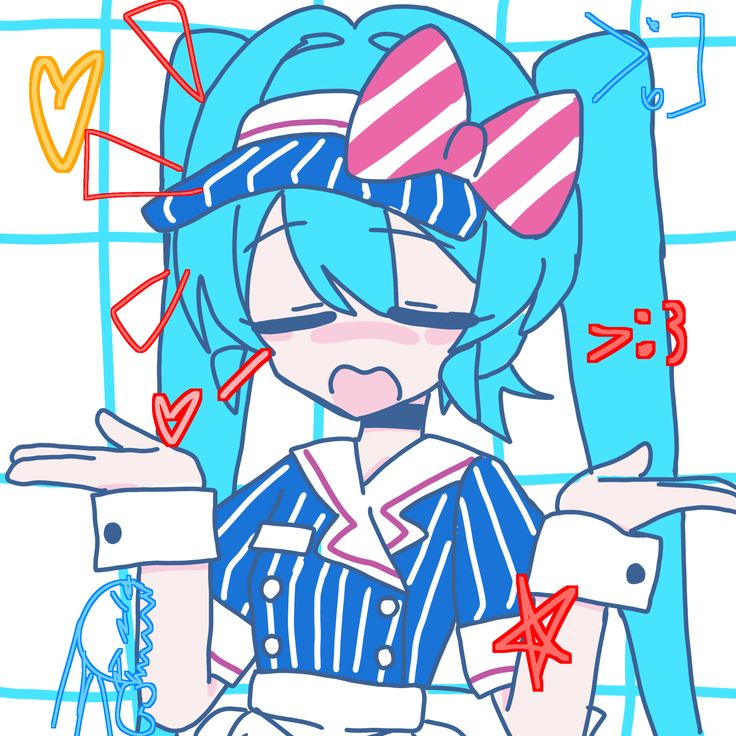

<h1 align="center">akikohatsune</h1>

  

  miku-mode: on · playful build lab · ship small things that work

  <a href="https://komekokomi.id.vn">komekokomi.id.vn</a> ·
  <a href="https://www.facebook.com/koikishu32">fb/koikishu32</a>

---

## about
hello. i’m AkikoC:\ but sometimes i answer to “hey miku”.
i build tiny tools, automate the boring parts, and keep projects neat enough to reuse.
if it looks like a joke project, it probably still has a checklist.

## soundcheck (what i usually touch)
- python, typescript/javascript, lua
- bots/automation
- web tooling
- modded/addon-style projects

## setlist (projects)
- autoban-clone: discord moderation bot experiments (ban/kick, logs, rules)
- simplekick: small discord utilities
- nuoi-lucifer: typescript project
- luatxt: lua utilities
- onion-domaincustom: notes/experiments around custom onion naming

## stats

  

  

## contact
- https://komekokomi.id.vn
- https://www.facebook.com/koikishu32
- alt: LumineFederator

---

  miku says: compile the fun. ship the result.

